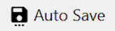

# Motion Analysis 2D

## Installation

Download latest release from [here](https://github.com/cps-lab-saga/motion-analysis-2d/releases).

<!-- OPERATION -->
## Importing Videos
<b>Known supported video formats: mp4, avi, mkv</b>

* File > Open Video File `Ctrl+O`

* Alternatively, drag and drop into “Files”. Videos can be navigated by clicking, or by using `D` for the next video, and `E` for previous. 

<b>Batch Processing:</b> Enables running automatic motion analysis of consecutive video files. 

## Video Adjustment
<b>Orientation:</b>

When opening video files, orientation might differ.

*  Rotates the video. It can be clicked multiple times.

*  Mirrors the video. Likewise, it can be clicked multiple times for mirroring vertically and horizontally. 

<b>Lens Distortion:</b>

<b>Perspective Correction and Scale:</b>

## Preparation for Motion Analysis 
Once a valid video file is opened, buttons for trackers, angles, and distances will be enabled. 

<b>Tracker:</b>

*  Enables tracking placement. The first click places the tracking point. Subsequent clicks delimit the tracking box. After placement, a pop up window will appear, allowing the user to name the tracker, choose tracking algorithm and colour. The `R` key on the keyboard resets the trackers. 

<b>Tracking algorithms:</b>
CSRT is set as default. Median Flow, KCF, Boosting, MOSSE, MIL are other available options. Please check other [documentation](https://broutonlab.com/blog/opencv-object-tracking/) on specificities of each tracker. Making the tracking point static is also an option.

<b>Angle:</b>

*  Prompts angle selection. Three tracking points are needed to enable an angle. This process is done in a succession of 4 clicks: 

1. The first click will define which tracking point will be the vertex used to calculate the angle.
2. Defines the first line.
3. Should be placed in the coinciding* vertex.
4. Defines the second line.

*Vertexes do not necessarily need to coincide. Calculating angles between two disconnected lines is also possible.

<b>Distance:</b>

*  Adds a distance. Distances can be set between two tracking points. 

<b>Delete:</b>

*  After clicking this button, click on any tracking point you would like to delete.

<b>Items:</b>
* All trackers, angles, and distances are listed here. They can be disabled and enabled. Clicking with the right button over an item allows the user to edit or delete it. 

## Running Motion Analysis

Once trackers are placed, click the  
 button to enable automatic motion tracking `T` using the defined algorithms. 

*  Will play the video `G`. If automatic motion tracking is enabled, the software will analyse every frame onwards. 

*  Is used to navigate the footage frame by frame (`F` for the next frame, `S` for previous). If automatic motion tracking is enabled, frames will be analysed.

* <b>For adjustments in tracker placement and for reviewing already analysed video, please disable the automatic motion tracking.</b>

<b>Data Plots:</b>
* This tab shows values for y and x throughout the analysed footage for trackers, angles, and distances. 

## Saving and Exporting Data

The software will create a temporary .json file within the folder where the analysed video is located. This file is used by the program as a log.

*  Enabling Auto Save `A` maintains the temporary .json file, even after finishing processing a video. This file can be used to process data, and can be dragged and dropped into new videos to use the same, already set, tracking points.

*  Will export `V` tracking point coordinates and calculated angles and distances as a .csv file.
  
## Menu

Edit > Shortcuts `Ctrl+Shift+S`: Lists all keyboard shortcuts.

Edit > Visual Preferences `Ctrl+Shift+P`: Allows for editing default colours of items and width of visible lines. 
